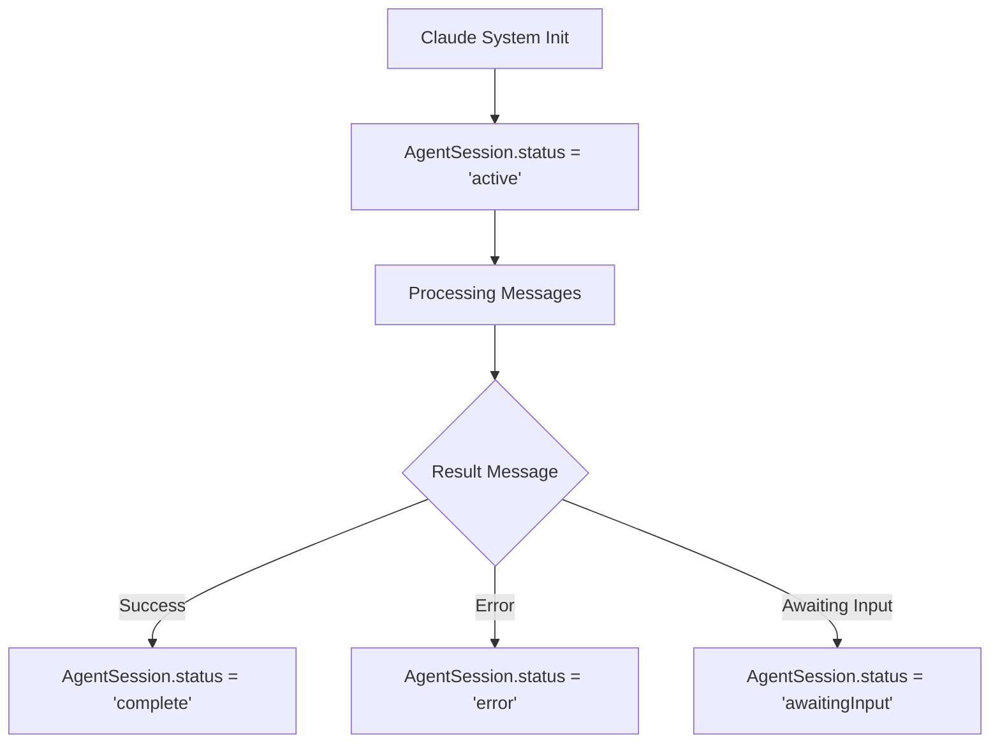
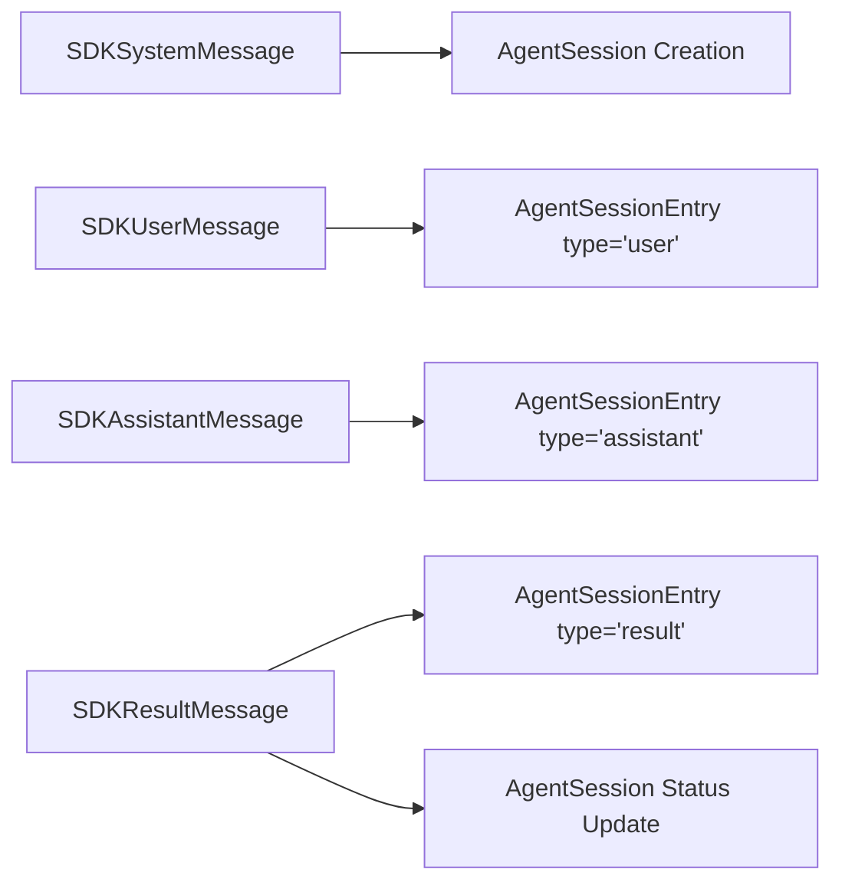

# Linear Agent Sessions & Claude Code SDK Integration

## Overview

This document provides a comprehensive mapping between Claude Code SDK streaming output and Linear's Agent Sessions model. This mapping enables seamless integration between Claude's conversational AI capabilities and Linear's issue tracking system.

## Updated Dependencies

- **@anthropic-ai/claude-code**: Updated to `^1.0.53` (from `^1.0.43`)
- **@linear/sdk**: Updated to `^52.0.0` (from `^39.0.0`)

## Claude Code SDK Message Schema

### Core Message Types

#### 1. System Initialization Message
```typescript
interface SDKSystemMessage {
  type: 'system'
  subtype: 'init'
  apiKeySource: ApiKeySource
  cwd: string
  session_id: string
  tools: string[]
  mcp_servers: {
    name: string
    status: string
  }[]
  model: string
  permissionMode: PermissionMode
}
```

#### 2. User Message
```typescript
interface SDKUserMessage {
  type: 'user'
  message: MessageParam  // Anthropic SDK type
  parent_tool_use_id: string | null
  session_id: string
}
```

#### 3. Assistant Message
```typescript
interface SDKAssistantMessage {
  type: 'assistant'
  message: Message  // Anthropic SDK type
  parent_tool_use_id: string | null
  session_id: string
}
```

#### 4. Result Message
```typescript
interface SDKResultMessage {
  type: 'result'
  subtype: 'success' | 'error_max_turns' | 'error_during_execution'
  duration_ms: number
  duration_api_ms: number
  is_error: boolean
  num_turns: number
  result?: string  // Only present for success
  session_id: string
  total_cost_usd: number
  usage: NonNullableUsage
}
```

### Supporting Types

```typescript
type ApiKeySource = 'user' | 'project' | 'org' | 'temporary'
type PermissionMode = 'default' | 'acceptEdits' | 'bypassPermissions' | 'plan'

interface NonNullableUsage {
  input_tokens: number
  output_tokens: number
  cache_creation_input_tokens?: number
  cache_read_input_tokens?: number
}
```

## Linear Agent Sessions Model

Based on Linear SDK analysis, the Agent Sessions model includes:

### Agent Session Types
```typescript
enum AgentSessionType {
  Action = "action",
  Elicitation = "elicitation", 
  Error = "error",
  Prompt = "prompt",
  Response = "response",
  Thought = "thought"
}

enum AgentSessionStatus {
  Active = "active",
  AwaitingInput = "awaitingInput",
  Complete = "complete", 
  Error = "error",
  Pending = "pending"
}

enum AgentSessionContext {
  CommentThread = "commentThread"
}
```

### Inferred Agent Session Structure
```typescript
interface AgentSession {
  id: string
  type: AgentSessionType
  status: AgentSessionStatus
  context: AgentSessionContext
  issueId: string
  sessionId: string
  createdAt: Date
  updatedAt: Date
  metadata?: {
    model?: string
    tools?: string[]
    permissionMode?: string
    apiKeySource?: string
    totalCostUsd?: number
    usage?: NonNullableUsage
  }
}

interface AgentSessionEntry {
  id: string
  sessionId: string
  type: 'user' | 'assistant' | 'system' | 'result'
  content: string
  metadata?: {
    toolUseId?: string
    parentToolUseId?: string
    timestamp: Date
    durationMs?: number
    isError?: boolean
  }
}
```

## Mapping Strategy

### 1. Session Management

| Claude Code SDK | Linear Agent Sessions | Notes |
|----------------|----------------------|-------|
| `session_id` | `AgentSession.sessionId` | Direct mapping |
| `SDKSystemMessage` | `AgentSession.type = 'prompt'` | Initialize session |
| `SDKResultMessage.subtype = 'success'` | `AgentSession.status = 'complete'` | Session completion |
| `SDKResultMessage.subtype = 'error_*'` | `AgentSession.status = 'error'` | Session error |

### 2. Message Flow Mapping

#### System Init → Session Creation
```typescript
// Claude Code SDK
const systemMessage: SDKSystemMessage = {
  type: 'system',
  subtype: 'init',
  session_id: 'abc123',
  model: 'claude-3-sonnet',
  tools: ['bash', 'editor'],
  // ...
}

// Linear Agent Sessions
const agentSession: AgentSession = {
  id: generateId(),
  type: AgentSessionType.Prompt,
  status: AgentSessionStatus.Active,
  context: AgentSessionContext.CommentThread,
  issueId: 'linear-issue-id',
  sessionId: 'abc123',
  metadata: {
    model: 'claude-3-sonnet',
    tools: ['bash', 'editor'],
    permissionMode: systemMessage.permissionMode,
    apiKeySource: systemMessage.apiKeySource
  }
}
```

#### User Message → Session Entry
```typescript
// Claude Code SDK
const userMessage: SDKUserMessage = {
  type: 'user',
  message: { role: 'user', content: 'Fix this bug' },
  parent_tool_use_id: null,
  session_id: 'abc123'
}

// Linear Agent Sessions
const sessionEntry: AgentSessionEntry = {
  id: generateId(),
  sessionId: 'abc123',
  type: 'user',
  content: 'Fix this bug',
  metadata: {
    timestamp: new Date(),
    parentToolUseId: null
  }
}
```

#### Assistant Message → Session Entry
```typescript
// Claude Code SDK
const assistantMessage: SDKAssistantMessage = {
  type: 'assistant',
  message: { 
    role: 'assistant', 
    content: [
      { type: 'text', text: 'I'll help you fix this bug.' },
      { type: 'tool_use', id: 'tool_123', name: 'bash', input: { command: 'git status' } }
    ]
  },
  parent_tool_use_id: null,
  session_id: 'abc123'
}

// Linear Agent Sessions
const sessionEntry: AgentSessionEntry = {
  id: generateId(),
  sessionId: 'abc123',
  type: 'assistant',
  content: extractContentFromMessage(assistantMessage.message),
  metadata: {
    timestamp: new Date(),
    toolUseId: extractToolUseId(assistantMessage.message),
    parentToolUseId: assistantMessage.parent_tool_use_id
  }
}
```

#### Result Message → Session Completion
```typescript
// Claude Code SDK
const resultMessage: SDKResultMessage = {
  type: 'result',
  subtype: 'success',
  duration_ms: 45000,
  duration_api_ms: 12000,
  is_error: false,
  num_turns: 8,
  result: 'Bug fixed successfully',
  session_id: 'abc123',
  total_cost_usd: 0.23,
  usage: {
    input_tokens: 1500,
    output_tokens: 800
  }
}

// Linear Agent Sessions - Update existing session
const updatedSession: Partial<AgentSession> = {
  status: AgentSessionStatus.Complete,
  updatedAt: new Date(),
  metadata: {
    ...existingSession.metadata,
    totalCostUsd: 0.23,
    usage: {
      input_tokens: 1500,
      output_tokens: 800
    }
  }
}

// Linear Agent Sessions - Create final entry
const finalEntry: AgentSessionEntry = {
  id: generateId(),
  sessionId: 'abc123',
  type: 'result',
  content: 'Bug fixed successfully',
  metadata: {
    timestamp: new Date(),
    durationMs: 45000,
    isError: false
  }
}
```

## State Transitions

### Session Status Flow


### Message Type Mapping


## Implementation Utilities

### Message Content Extraction
```typescript
function extractContentFromMessage(message: Message): string {
  if (typeof message.content === 'string') {
    return message.content;
  }
  
  if (Array.isArray(message.content)) {
    return message.content
      .map(block => {
        if (block.type === 'text') {
          return block.text;
        } else if (block.type === 'tool_use') {
          return `[Tool Use: ${block.name}]`;
        }
        return '';
      })
      .filter(Boolean)
      .join('\n');
  }
  
  return '';
}

function extractToolUseId(message: Message): string | undefined {
  if (Array.isArray(message.content)) {
    const toolUse = message.content.find(block => block.type === 'tool_use');
    return toolUse?.id;
  }
  return undefined;
}
```

### Session State Management
```typescript
class AgentSessionManager {
  async createSession(systemMessage: SDKSystemMessage, issueId: string): Promise<AgentSession> {
    return {
      id: generateId(),
      type: AgentSessionType.Prompt,
      status: AgentSessionStatus.Active,
      context: AgentSessionContext.CommentThread,
      issueId,
      sessionId: systemMessage.session_id,
      createdAt: new Date(),
      updatedAt: new Date(),
      metadata: {
        model: systemMessage.model,
        tools: systemMessage.tools,
        permissionMode: systemMessage.permissionMode,
        apiKeySource: systemMessage.apiKeySource
      }
    };
  }

  async addSessionEntry(sessionId: string, sdkMessage: SDKUserMessage | SDKAssistantMessage): Promise<AgentSessionEntry> {
    return {
      id: generateId(),
      sessionId,
      type: sdkMessage.type,
      content: this.extractContent(sdkMessage),
      metadata: {
        timestamp: new Date(),
        parentToolUseId: sdkMessage.parent_tool_use_id,
        ...(sdkMessage.type === 'assistant' && {
          toolUseId: this.extractToolUseId(sdkMessage)
        })
      }
    };
  }

  async completeSession(sessionId: string, resultMessage: SDKResultMessage): Promise<void> {
    const status = resultMessage.subtype === 'success' 
      ? AgentSessionStatus.Complete 
      : AgentSessionStatus.Error;
    
    // Update session status and metadata
    await this.updateSessionStatus(sessionId, status, {
      totalCostUsd: resultMessage.total_cost_usd,
      usage: resultMessage.usage
    });
    
    // Add result entry if present
    if (resultMessage.result) {
      await this.addResultEntry(sessionId, resultMessage);
    }
  }
}
```

## Integration Points

### 1. Claude Runner Integration
- **Location**: `packages/claude-runner/src/ClaudeRunner.ts`
- **Responsibility**: Capture and transform Claude Code SDK streaming messages into Agent Session format
- **Key Methods**: `onMessage()` callback transforms SDKMessage to AgentSessionEntry, tracks session metadata
- **Implementation**: Add AgentSessionManager to process streaming messages in real-time

### 2. Core Session Management
- **Location**: `packages/core/src/session/AgentSessionManager.ts` (new)
- **Responsibility**: Manage Agent Session lifecycle and Linear API integration
- **Key Methods**: `createSession()`, `addSessionEntry()`, `completeSession()`, `syncToLinear()`
- **Implementation**: Bridge between Claude Code SDK types and Linear Agent Sessions API

### 3. Edge Worker Integration
- **Location**: `packages/edge-worker/src/EdgeWorker.ts`
- **Responsibility**: Coordinate Agent Session tracking across distributed Claude runners
- **Key Methods**: `handleClaudeMessage()` enhanced to create Agent Sessions, `initializeAgentSession()` on issue assignment
- **Implementation**: Ensure each Linear issue gets corresponding Agent Session tracking

## Benefits of This Mapping

1. **Comprehensive Tracking**: Every Claude Code interaction is captured in Linear
2. **Rich Context**: Tool usage, costs, and performance metrics are preserved
3. **Seamless Integration**: Existing Cyrus workflows continue to work with enhanced tracking
4. **Future-Proof**: Ready for Linear's Agent Sessions API when it becomes available
5. **Debugging**: Full conversation history aids in troubleshooting agent behavior

## Implementation Plan

### Phase 1: Core Infrastructure ✅ COMPLETED
1. **Create AgentSessionManager** in `packages/edge-worker/src/AgentSessionManager.ts` ✅
   - Implement message transformation utilities ✅
   - Add Linear Agent Sessions API integration ✅
   - Handle session lifecycle management ✅

### Phase 2: EdgeWorker Integration (Next)
2. **Update EdgeWorker.ts** key integration points:
   - **Line 911**: `handleClaudeMessage()` - Add AgentSessionManager to capture streaming messages
   - **Line 419**: `handleIssueAssignedWithFullIssue()` - Initialize Agent Sessions when creating Claude runners
   - **Line 631**: `handleNewComment()` - Link new comments to existing Agent Sessions
   - **Line 969**: `handleClaudeComplete()` - Mark sessions as complete with final results

### Phase 3: Testing & Validation
4. **Test with existing Cyrus workflows**
   - Verify Agent Sessions are created for each issue assignment
   - Validate message transformation accuracy
   - Ensure cost and performance tracking works correctly

5. **Add monitoring and logging**
   - Track Agent Session creation/completion rates
   - Monitor API usage and performance
   - Add debugging tools for session analysis

---

*This mapping provides a senior engineer-level integration between Claude Code SDK and Linear Agent Sessions, ensuring robust tracking and management of AI agent interactions within the Linear ecosystem.*